# High Octane
## Site Introduction
High Octane is a fun game site for car lovers to test their knowledge on 3 different car stats. The website has been made as I love cars personally and wanted to join my 2 passions. Alternatively, users who do not know much about cars can use this game to learn about new cars, potentially see cars they did not even know existed! Maybe just maybe they will begin to share the same love as me for cars from playing my game.

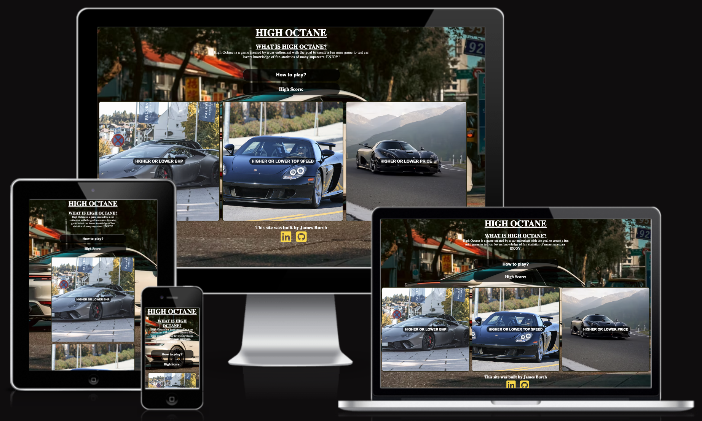
## Planning the website/game
### Site purpose
 - Have a fun easy game for car lovers to play to test their knowledge of many different cars.
 - Be able to track previous high scores and compete to beat the previous high score.
 - End the game when the user gets the answer wrong, display their final score and give the option to play again or return to the main menu to select another game
### Easy to navigate
 - I made sure to encorporate a simple easy to follow design to the page so that the user can easily start to play the game of their choice, return to the main menu and open/close the how to play menu.
 - Part of making the site easy to navigate in this project was using the :hover CSS to allow for the users on laptops/desktops to easily navigate the site with pointer cursor, colour flip when hovering and the transitions to enlarge the buttons to prompt the user to click.
 - I have used flex to make the site fully responsive so that is best uses the space across all screen sizes, using flex makes the code easy to navigate as there are less media queries required.
 - The colour choice is very simple, I started of using a 4 color palette I found on Canva but as I went on to tidy up the site I decided that using images and simple black overlays with white text created the look that I wanted for the site. The colours were kept simple for the end site as there is already alot going on with the images so the text being bold makes every peice of text clear to read
 - I wanted to make the workspace easy to navigate also, for this reason I have created 2 javascript files with one to contain all of the car information in the array and one to carry out my functional code to make the website work and pull the information from the info.js file.
 - I also had the idea of keeping with 1 html file and using javascript and css to hide and unhide the different areas of the code when the respective buttons are clicked on. This will also be linked with the game functions to start and end the games.
 - I have planned/tried to use comments to effectively explain code and its functions so that if anything needs to be added or edited in future I can easily understand what each peice of code is doing or linked too.
### Target Audience
 - My target audience for this site is primarily car lovers and enthusiasts who want to test their knowledge.
 - People who want a simple fun game to play in their spare time.
 - People who want to test their knowledge of cars.
 - People who want to learn more about cars.
 - Groups of friends who want to have a bit of friendly competition with a fun easy to use game to see who can get the highest score
### How will I acheive all of this?
- I have added meta tags to the head of my page so that people looking for a higher or lower game, car game, fun game to play can find my site and play.
- I have added clear easy to read instructions for how to plan the games so that if users are unsure on how to play they can simply open the 'How to play?' menu and read the instructions, close the menu using the big 'X' in the corner and select the game they want to play.
- I have added clear text to show the user that when they click each game button they know what stat they will be guessing if it is higher or lower for.
- On the game screen there is a 'Score' overlay in the corner to show the user their current score, this updates as they play.
- I have added a play again and main menu button to the final score screen once the user inputs an incorrect answer which clearly allows the user to navigate around the site.
- All buttons on the site have media queries setup so that when a mouse hovers the buttons enlarge and colours flip to clearly show what the user is hovering over.
### Tools/Input from others
 - I plan to share the website with my friends who are also car enthusiasts to get their opinions and find any issues with the site for me to rectify.
 - I will speak with other students at Code Institute to gather opinions on things that I may be able to change/add and also things that I have missed. I believe it is always good to have another opinion or set of eyes to look over your work as there is always bits you miss yourself.
  - Tools I used for this project:
   - HTML and CSS Validators
   - Lighthouse in the dev tools
   - Chatgpt, this was only used to pick a list of super cars names and find out all of the information about them that I needed to save myself time having to google 50+ cars stats. I will also use this to spell check my work.
   - All of the images are sourced from free websites on google or from google images.
   - Favicon has been used to add the favicon car silhoutte to my page.
   - Fontawesome has been used to add the social media icon links to my pages.
   - I have used JSHint to help with my javascript code when possible.
## Features and Functions of my page
### Main menu
The main menu page consists of a short introduction of High Octane and what the site is, with a clear 'How To Play?', 3 game screens which the user can select which game they would like to play, a high score tab which will begin to track and dsiplay a users high score each time they play and a footer with links to my github and linked in.

### How to play screen
The how to play menu display a background image of a Lamborginhi Aventador SVJ with the short and simple instructions on how to navigate the site and play the games. I have kept this menu as simple as possible whilst trying to maintain the sleek look I want for the page. The page has an 'X' fontawesome icon in the corner to prompt the user to click and close the menu once they have read it to return to the main menu. This has been done using a selection of CSS and Javascript eventlisteners.

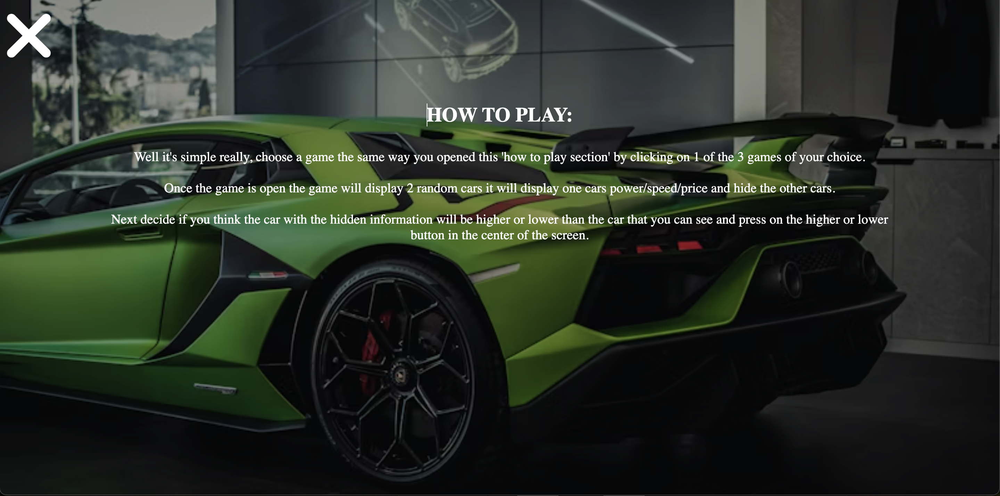
### Game screens
Each game screen has the same look as it reuses the same HTML and CSS, the javascript code has 'if' and 'else' to decide which game has been opened and what information it needs to display in the HTML. I decided to display each car as a column on all screens as I liked how this displayed and I never experienced any errors with this layout, it is easy to use and navigate on all screen sizes. 

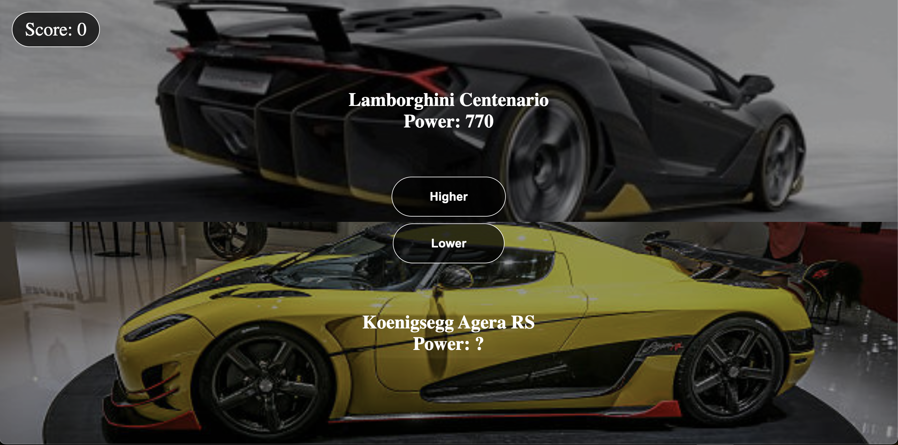
### Fail screen
The idea for this screen was to display a funny image of a recognisable personality in the motoring world for when the user inputs an incorrect answer and ends the game. The screen also displays the final score that the user got too and the options to either play again or return to the main menu where if the final score was higher than the previous high score it will display the new high score.

### JavaScript functions
I have used many different javascript functions for my project, not only does the game run through the javascript but the actual display to open and close the different html elements is done through javascript event listeners. I have done this as I wanted to showcase my skills to use javascript and only use one HTML file. There will be a more detailed desription later in the readme file.
#### Random car function
I have used javascript to generate a random number to be used to select a car at random when the game is started and the user gets a correct answer. There is also a function which compares the cars to make sure the same car can never be chosen at the same time, if they are the same it will generate a new car until it is different. It then uses this information and inputs the random cars information into the HTML.
#### Score Section
The score area of the game screen uses javascript code to update when the user inputs a correct answer and track how many answers the user has guessed correctly, this score will continuesly update until a wrong answer has been input. I decided to display this in the corner of the screen so that it does not get in the way but is big enough to be seen and the user can track their current score.

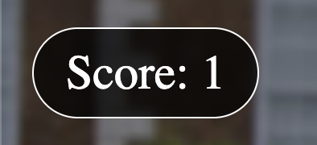
#### Higher or Lower Buttons
- The higher or lower buttons are linked to the game function so that when they are clicked an event listener waiting for a click triggers the code to compare the 2 car stats to see if the answer the user has input, for example if the car displayed has 100bhp and the car the user is trying to guess is higher or lower has 120bhp if the user inputs higher the code will compare the 2 figures to see if the hidden cars bhp is more than the cars power the user can see and vice versa for the lower button.
- I have displayed these buttons in the middle of the screen for all screen sizes between each car to make it obvious to the user that they are selecting higher or lower between the 2 displayed cars.

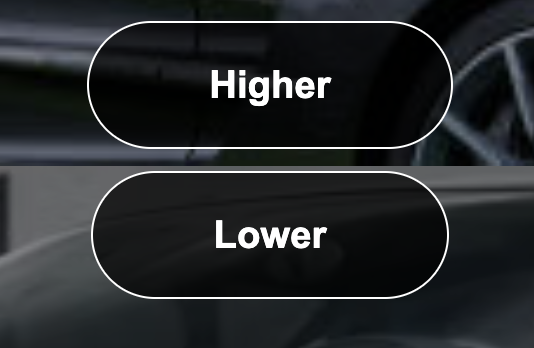
- I have used consistent CSS to style the buttons and score display throughout my page, I believe this creates a better overall user experience.
#### Fail screen buttons
- The fail screen buttons have 2 options, one to play again and restart the same game and second one to allow the user to return to the main menu.
 - Play again: This button has an event listener attached so that when the button is clicked it activates the code to start the game over and reset the score, this then displays the game screen again.
 - Main menu: This button has an event listener attached so that when the button is clicked it activates the code to display the main menu, end the game and if the final score is more than the high score it will update the high score and display the users new high score.
- The screen also displays the final score from the game that the user has just played.

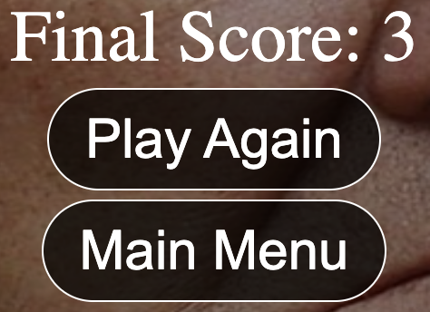
### Footer
-  I have added a 'Built by James Burch' with my linked in and github links into the footer of the site as I would like for people who visit to be able to find me and see the other work that I have done.

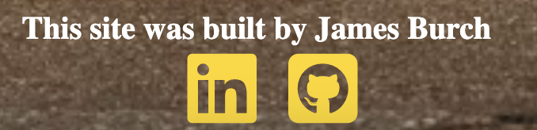
## Future Enhancements
- One thing that I would love to add in the future is more cars to make the game more challenging.
- I would like to add more game modes where there is differnt car types to choose from ie, supercars, sportscars and hypercar categories so that it tests the users car knowledge even more as a lot of cars in the same category can be similarly matched.
- I could also add different game modes for the different stats about cars such as the weight of the car, miles per galon, 0-60mph time and amount of cars produced.
- Currently the game continues until the user inputs a wrong answer, I could setup something so that the user gets 3 lives in each 24 hour period, they can continue to play by using a life to keep their score however, once they are out of lives they must wait 24 hours to refresh their lives or they can pay to add more lives to allow them to carry on and play.
 - Alongside this option to add lives and a payable option I would create a leaderboard section where the users can see a display of the all time leaderboard diplaying the highest scores and how many lives have been used to get that score.
 - I would need to create a section where the user has to input a display username to display next to their score on the leaderboard.
- I could create a light and dark mode selector for the site so that the user can select if they want a darker colour scheme or lighter colour scheme.
## Testing 
### W3 Validators and Lighthouse score
- Just like in my previous project I have used these validators throughout to check my code for errors.
#### HTML Validation

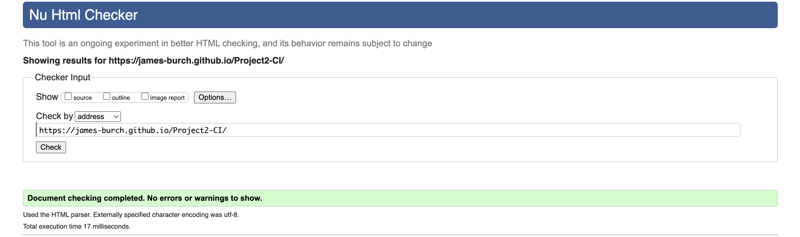
#### CSS Validation

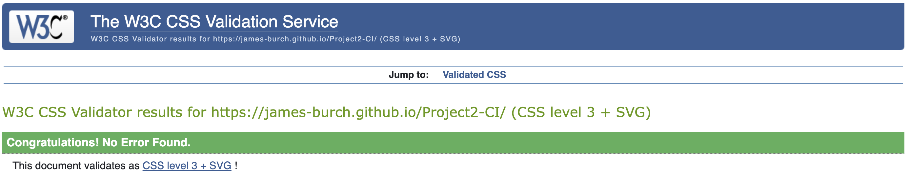
#### Lighthouse Score

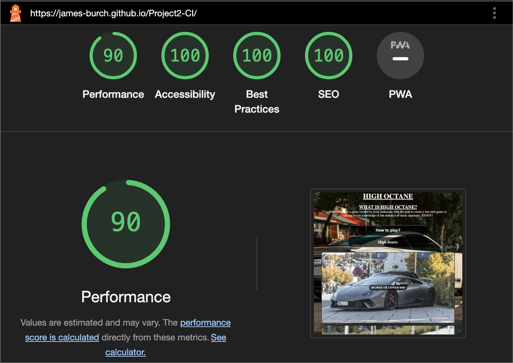
### JS Hint
- I have used JS Hint throughout my project as it has highlighted missing colons, apostrophies, backwards ticks etc where I otherwise would not have noticed.
- As my project consists of 2 javascript files to keep it easy to read and tidy I have added both files into the JS Hint to check. The below image shows the metrics.

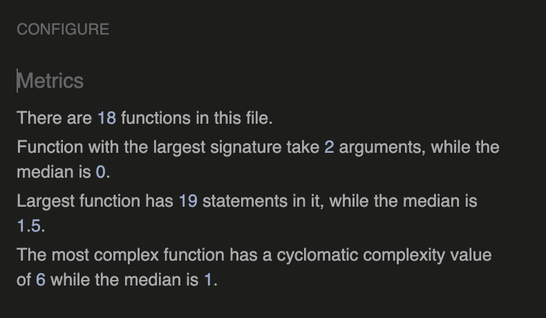

### Testing Table

| What I am testing? | How I tested it| Expected Outcome | Result |
| -- | -- | -- | -- |
| How to play button | Click the button | Main menu hide, how to play section display | Pass |
| Horizontal scroll | Check every page display on each screen size | No horizontal scroll | Pass |
| Score function | Play game | Score update with correct answers | Pass |
| High Score | Play game and get a high score | New high score should display on main menu | Pass |
| Random Car function | Play game | Display a different car everytime | Pass |
| Check responsiveness | Check every page on each screen size | Every page be readable and easy to navigate | Pass |
| Test website displays well on other browsers | Open my link on other browsers | Website will look good on each browser | Pass |
| Wrong answer menu | Purposefully answer wrong in the game | Display the final score, play again and main menu button | Pass|

## Bugs and Fixes
- The first major bug that I ran into was that my javascript files were not loading in the correct order to load the info.js file before the script.js file so that the code trying to pull the cars from the array did not know where to pull it from. I figured out how to fix this when I was playing around with a playground repostiroy I made to help make this project as I would create each function individually and work out how to implement it, after looking at the 2 repositories I noticed that when I was linking the files to the HTML file I had the info.js linked on the line above the script.js file, I then mimicked this on my project and it fixed this issue.
 - If these files were the other way around the game would not be able to work as it wouldn't know where to find the cars information and image file path.

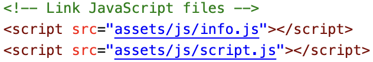
- I originally started with completely differnt javascript functions as I did not know how to plan ahead, so I had the game selection buttons set up to display an individual screen to each game mode, this meant that I had 3 different HTML sections for each game screen display. Once I got further into the project and creating the startGame function I realised that my code was going to get very messy as I would need to have 3 different functions for each game mode.
Once I released that this was going to get very messy I started to rework my code to what it is now, it had reduced the size of the code substantially whilst maintaining the function, the new code uses 'else' and 'if' statements to query what game mode the user has input, it will then check what details it needs to input into the HTML game section.
This also allows for future enhancements to be made as I can easily add more game types by adding the relevant 'else' and 'if' statements to query if the new game has been selected or not.

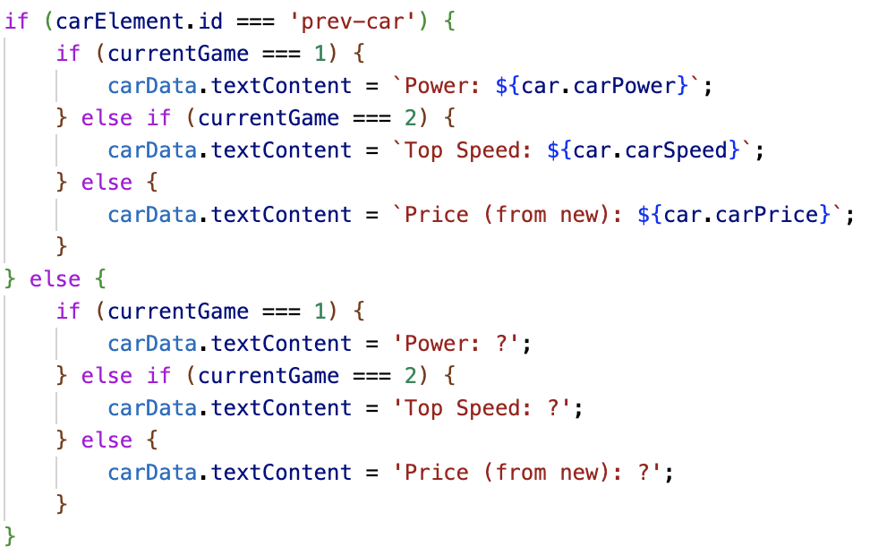
- Whilst writing my readme.md file, specifically running my project through the validators there were some issues highlighted to me by the W3 HTML Validator such as:
 - The H1 element was located in the wrong place on the page and throwing up and error, I sorted this by changing my main element to only enclose the main menu content and removed the section with id="main-menu" and moved the id selector to the '<main>' element, this has now removed the error.
 
 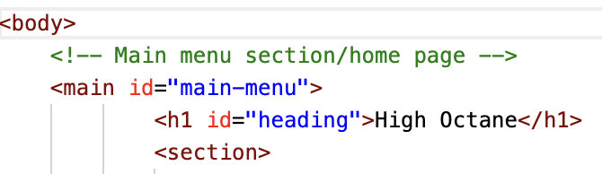
 - I had a small issue with getting my high score element to work, I had written the code that was correct orignally however it did not work... After investigation and talking it through with my mentor Alan I soon realised why it was not working, it was as simple as I had different id selectors in the HTML to what I was linking the function too in my JS file. This was a quick easy fix but something that I was not able to notice until looking through my project with a second pair of eyes.
 - My original images were extremely poor quality so I decided to spend some time going through looking on google for high resolution car images to use to create a better UX.
 - I had a bug where the game function did not work properly to begin with when I revised the code, when the game started it selected 2 random cars and displayed them however when the user inputted higher or lower it would reset and select 2 new cars, I realised that I had called the startGame function in the wrong area which was causing this to happen, once I had removed this code the game function worked perfectly how it was intended.

## Deployment
How I deployed my site

1. Open the repository on github
2. Click on the settings button
3. Once open click on pages
4. Once on pages select the branch drop down and change to main
5. Wait for the site to deploy

Link to the live site : <a href="https://james-burch.github.io/Project2-CI/" rel="noopener">Click Here for High Octane</a>
## Extras
- You may be wondering why there is no use of a specific font... Well yet again for this project I started coding and writing my site without choosing a font and as I got further into the project I decided to opt for the standard font again as I acheived the final look that I wanted to go for.
- I have purposefully avoided putting a button or option to allow the user to return to the home screen after starting a game, I designed it this way as once a game is started I want the user to play until they get an answer wrong as I think this makes it more fun!
- The highscore function works with the local storage so that whenever a user opens my page it will have their previous highscore saved and it will continue to update accordingly
## Credits
- Thanks to Alan my mentor for guiding me throughout this project and helping me find the source of the errors and bugs in my code and not just giving me a fix for it straight away.
- Thanks to my fellow students who have been kind enough to give pointers with my code and help me with some errors along the way.
- All of the images were sourced from Google or free sites for people to share their images in high resolution (gettyimages is where the majority were sourced from).
- Chat GPT was used to create a list of super cars and assign the correct power, price and topspeed to save myself time having to research and input each car individually.
- I used W3 schools to help with some javascript code to get the basic structure it needed to be written in so that I could tailor it to my needs.
- All of the HTML, CSS and functional JS was written by myself, the info.js array as mentioned had all of the correct info dded by ChatGPT for speed, but it did not write any of my code.
- The love maths project influenced my home page design with the way that the different games are displayed across the screen like the icons were on that project, I also used this walk through to refresh my memory on how to generate a random number and manipulate it to pick a random car from my array.
